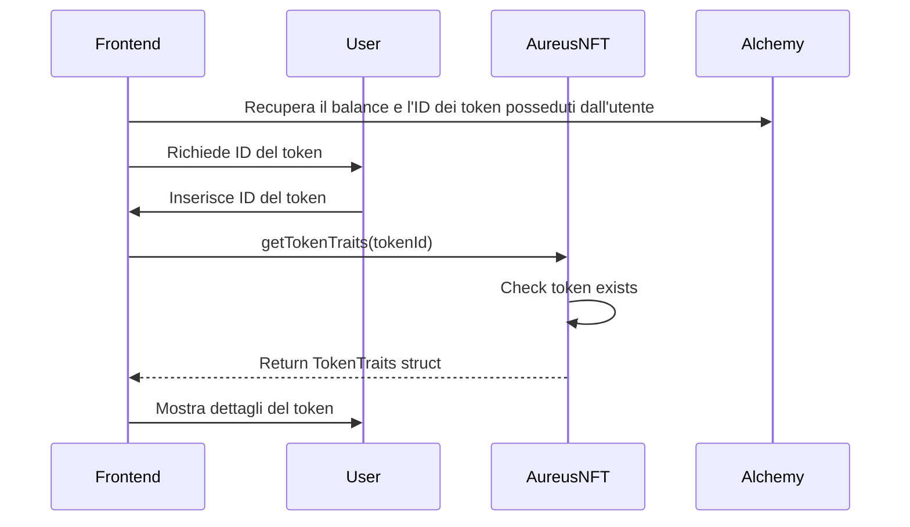
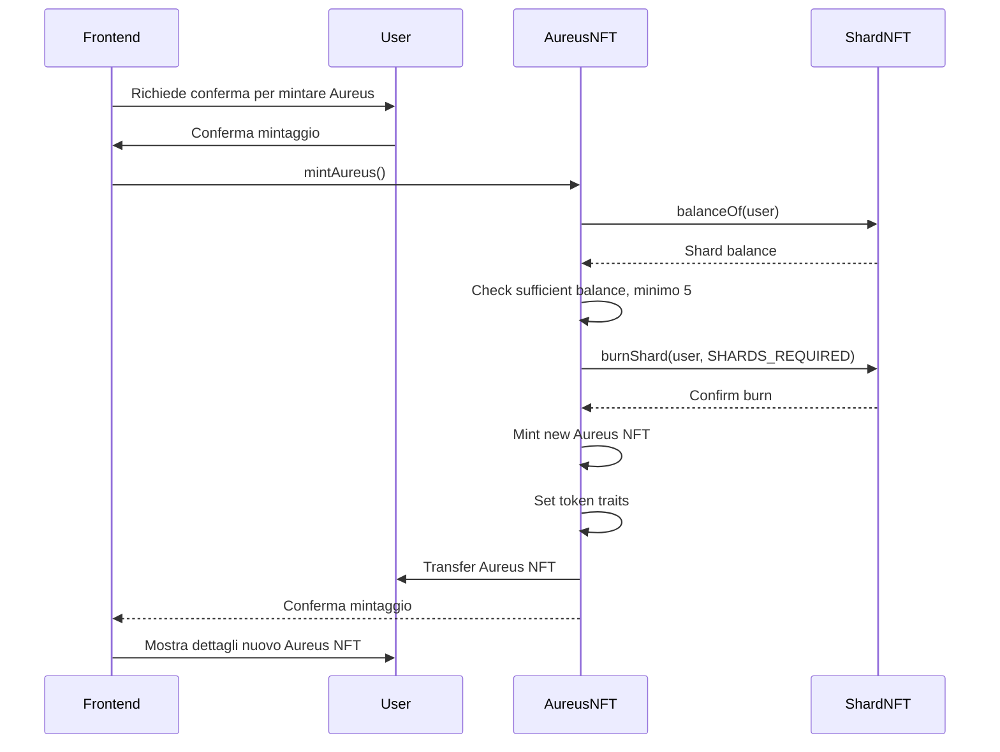
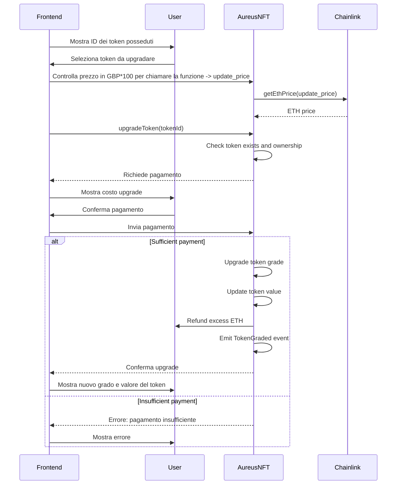
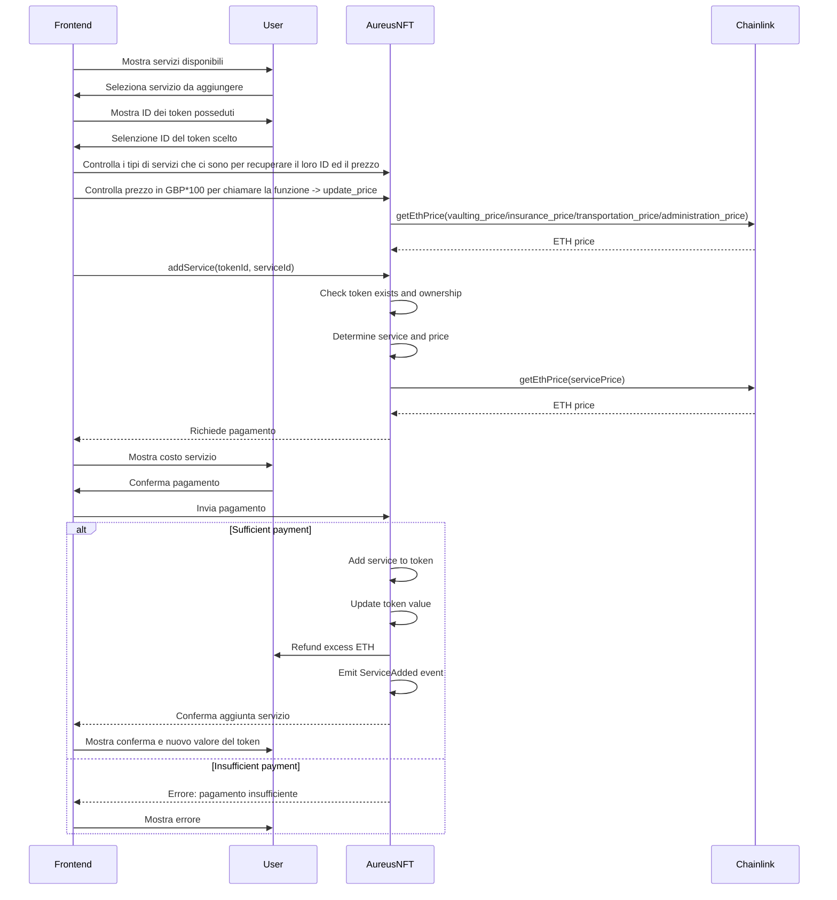

# AureusNFT Frontend Interface
Questa è un'implementazione frontend per il contratto AureusNFT utilizzando React e Wagmi per l'interazione con la blockchain Ethereum.
## Sommario
- [Configurazione iniziale](#configurazione-iniziale)
- [Funzioni di lettura](#funzioni-di-lettura)
- [Funzioni di scrittura](#funzioni-di-scrittura)
- [Funzioni amministrative](#funzioni-amministrative)
## Configurazione iniziale
Per iniziare, configura Wagmi nel tuo progetto React:
```javascript
import { createConfig, configureChains, mainnet } from 'wagmi'
import { publicProvider } from 'wagmi/providers/public'
import { MetaMaskConnector } from 'wagmi/connectors/metaMask'

const { chains, publicClient, webSocketPublicClient } = configureChains(
  [mainnet],
  [publicProvider()]
)

const config = createConfig({
  autoConnect: true,
  connectors: [new MetaMaskConnector({ chains })],
  publicClient,
  webSocketPublicClient,
})

function App() {
  return (
    <WagmiConfig config={config}>
      {/* Your app components */}
    </WagmiConfig>
  )
}
```
Questa configurazione inizializza Wagmi per interagire con la mainnet Ethereum usando MetaMask come connettore principale.
## Variabili in lettura
```solidity
//Prezzo di una shard in GPB*100
uint256 public currentPrice;

//Supply massima delle shard
uint256 public constant MAX_SUPPLY = 25000;

//Massimo ammontare di shrd acquistabili in una transazione
uint256 public constant MAX_MINT_PER_TX = 5;

//Totale shard mintate
uint256 public totalMinted = 0;
```
## Funzioni di lettura
### getTokenTraits
```solidity
//Questo componente mostra i tratti di ogni Aureus per token ID
function getTokenTraits(uint256 tokenId) public view returns (TokenTraits memory) {
        require(_exists(tokenId), "Token does not exist");
        return tokenTraits[tokenId];
    }
```
Questo componente mostra i tratti di un token Aureus NFT specifico.

```javascript
function TokenTraitsInfo({ tokenId }) {
  const { data: tokenTraits } = useContractRead({
    address: aureusNFTAddress,
    abi: aureusNFTABI,
    functionName: 'getTokenTraits',
    args: [tokenId],
  })

  return (
    <div>
      <h3>Token Traits for ID: {tokenId}</h3>
      <p>Grade: {tokenTraits?.grade.toString()}</p>
      <p>Value: {tokenTraits?.value.toString()}</p>
      <p>Has Vaulting: {tokenTraits?.hasVaulting ? 'Yes' : 'No'}</p>
      <p>Has Insurance: {tokenTraits?.hasInsurance ? 'Yes' : 'No'}</p>
      <p>Has Transportation: {tokenTraits?.hasTransportation ? 'Yes' : 'No'}</p>
      <p>Administration End: {new Date(tokenTraits?.administrationEndTimestamp * 1000).toLocaleString()}</p>
    </div>
  )
}
```
### getEthPrice
```solidity
//Questo componente mostra il valore in GBP*100 in wei di ETH
function getEthPrice(uint256 penceAmount) public view returns (uint256) {
        (, int256 ethUsdPrice,,,) = ethUsdPriceFeed.latestRoundData();
        (, int256 gbpUsdPrice,,,) = gbpUsdPriceFeed.latestRoundData();
        require(ethUsdPrice > 0 && gbpUsdPrice > 0, "Invalid price");
        
        uint256 ethPerUsd = uint256(ethUsdPrice); // 8 decimals
        uint256 gbpPerUsd = uint256(gbpUsdPrice); // 8 decimals
        
        uint256 numerator = penceAmount * 1e18;
        numerator = numerator * gbpPerUsd;
        uint256 denominator = ethPerUsd * 100;
        
        return numerator / denominator;
    }
```
Questo componente permette agli utenti di inserire un importo in GBP * 100 e vedere il corrispondente prezzo in ETH. Utilizza useContractRead con l'importo in pence come argomento per chiamare la funzione getEthPrice del contratto.
```javascript
function PriceInfo() {
  const [penceAmount, setPenceAmount] = useState('1000')
  const { data: ethPrice } = useContractRead({
    address: shardNFTAddress,
    abi: shardNFTABI,
    functionName: 'getEthPrice',
    args: [penceAmount],
  })

  return (
    <div>
      <input 
        type="number" 
        value={penceAmount} 
        onChange={(e) => setPenceAmount(e.target.value)}
      />
      <p>Price in ETH: {ethPrice ? ethers.utils.formatEther(ethPrice) : 'N/A'}</p>
    </div>
  )
}
```
### totalSupply
```solidity
function totalSupply() public view returns (uint256) {
        return _tokenIds.current();
    }
```
Questo componente mostra il numero totale di Aureus NFT mintati.
```javascript
function MintAureus() {
  const { config } = usePrepareContractWrite({
    address: aureusNFTAddress,
    abi: aureusNFTABI,
    functionName: 'mintAureus',
  })

  const { data, write } = useContractWrite(config)

  const { isLoading, isSuccess } = useWaitForTransaction({
    hash: data?.hash,
  })

  return (
    <div>
      <button onClick={() => write?.()}>Mint Aureus NFT</button>
      {isLoading && <p>Transaction pending...</p>}
      {isSuccess && <p>Successfully minted Aureus NFT!</p>}
    </div>
  )
}
```
### balanceOf
Questo componente utilizza useAccount per ottenere l'indirizzo del wallet connesso e poi useContractRead per chiamare balanceOf. Mostra il saldo di Shard NFT dell'utente corrente.
```javascript
 UserBalance() {
  const { address } = useAccount()
  const { data: balance } = useContractRead({
    address: shardNFTAddress,
    abi: shardNFTABI,
    functionName: 'balanceOf',
    args: [address, 0],
  })

  return <p>Your Shard balance: {balance?.toString()}</p>
}
```
## Funzioni di scrittura
### mintAureus
```solidity
//Questo funzione permette di mintare 1 Aureus bruciando shard 
function mintAureus() external nonReentrant whenNotPaused {
        require(_tokenIds.current() < MAX_SUPPLY, "Max supply reached");
        
        uint256 shardBalance = shardContract.balanceOf(msg.sender, 0);
        require(shardBalance >= SHARDS_REQUIRED, "Insufficient shard balance");
        
        uint256 newTokenId = _tokenIds.current();
        
        // Attempt to burn shards before minting
        try shardContract.burnShard(msg.sender, SHARDS_REQUIRED) {
            _tokenIds.increment();
            _safeMint(msg.sender, newTokenId);

            tokenTraits[newTokenId] = TokenTraits({
                grade: 0,
                value: base_value,
                hasVaulting: false,
                hasInsurance: false,
                hasTransportation: false,
                administrationEndTimestamp: 0,
                mintTimestamp: block.timestamp,
                redeemTimestamp: 0
            });
        } catch Error(string memory reason) {
            revert(string(abi.encodePacked("Failed to burn shards: ", reason)));
        } catch {
            revert("Failed to burn shards: unknown error");
        }
    }
```

Questo componente permette agli utenti di mintare un nuovo Aureus NFT. La funzione richiede un **balanceOf** di shard maggiore o  uguale a 5
```javascript
function MintAureus() {
  const { config } = usePrepareContractWrite({
    address: aureusNFTAddress,
    abi: aureusNFTABI,
    functionName: 'mintAureus',
  })

  const { data, write } = useContractWrite(config)

  const { isLoading, isSuccess } = useWaitForTransaction({
    hash: data?.hash,
  })

  return (
    <div>
      <button onClick={() => write?.()}>Mint Aureus NFT</button>
      {isLoading && <p>Transaction pending...</p>}
      {isSuccess && <p>Successfully minted Aureus NFT!</p>}
    </div>
  )
}
```
### mintAureus
```solidity
//Nomi variabili servizi di ogni Aureus
uint256 public update_price = 5000; // 50 GBP
uint256 public vaulting_price = 5000; // 50 GBP
uint256 public insurance_price = 5000; // 50 GBP
uint256 public transportation_price = 5000; // 50 GBP
uint256 public administration_price = 5000; // 50 GBP

//Questo funzione permette di recuperare i servizi che possono essere aggiunti ad ogni Aureus
function getServiceName(uint256 serviceId) public pure returns (string memory) {
        if (serviceId == 1) return "vaulting";
        if (serviceId == 2) return "insurance";
        if (serviceId == 3) return "transportation";
        if (serviceId == 4) return "administration";
        revert("Invalid service ID");
    }

//Questa funzione permette di upgradare la qualità dell' Aureus, la funzione è payable
function upgradeToken(uint256 tokenId) external payable nonReentrant whenNotPaused {
        require(_exists(tokenId), "Token does not exist");
        require(ownerOf(tokenId) == msg.sender, "Not token owner");
        require(tokenTraits[tokenId].grade < 70, "Invalid grade");

        uint256 priceInEth = getEthPrice(update_price);
        require(msg.value >= priceInEth, "Insufficient payment");
        
        if (tokenTraits[tokenId].grade == 0) {
            tokenTraits[tokenId].grade = 60;
        } else {
            tokenTraits[tokenId].grade++;
        }

        updateTokenValue(tokenId);
        emit TokenGraded(tokenId, tokenTraits[tokenId].grade);

        if(msg.value > priceInEth) {
            (bool success, ) = payable(msg.sender).call{value: msg.value - priceInEth}("");
            require(success, "Refund failed");
        }
    }

//Questo funzione permette di aggiungere un servizio ad un determinato Aureus, la funzione è payable
function addService(uint256 tokenId, uint256 serviceId) external payable nonReentrant whenNotPaused {
        require(_exists(tokenId), "Token does not exist");
        require(ownerOf(tokenId) == msg.sender, "Not token owner");
        TokenTraits storage traits = tokenTraits[tokenId];

        uint256 price;
        if (serviceId == 1) { // Vaulting
            require(!traits.hasVaulting, "Vaulting service already added");
            price = vaulting_price;
            traits.hasVaulting = true;
        } else if (serviceId == 2) { // Insurance
            require(!traits.hasInsurance, "Insurance service already added");
            price = insurance_price;
            traits.hasInsurance = true;
        } else if (serviceId == 3) { // Transportation
            require(!traits.hasTransportation, "Transportation service already added");
            price = transportation_price;
            traits.hasTransportation = true;
        } else if (serviceId == 4) { // Administration
            require(traits.administrationEndTimestamp < block.timestamp, "Administration service still active");
            price = administration_price;
            traits.administrationEndTimestamp = block.timestamp + 365 days; // 1 year
        } else {
            revert("Invalid service ID");
        }

        uint256 priceInEth = getEthPrice(price);
        require(msg.value >= priceInEth, "Insufficient payment");

        updateTokenValue(tokenId);
        emit ServiceAdded(tokenId, getServiceName(serviceId));

        if(msg.value > priceInEth) {
            (bool success, ) = payable(msg.sender).call{value: msg.value - priceInEth}("");
            require(success, "Refund failed");
        }
    }
```
Questo componente permette agli utenti di aggiornare il grado di un Aureus NFT.

```javascript
function UpgradeToken({ tokenId }) {
  const { data: ethPrice } = useContractRead({
    address: aureusNFTAddress,
    abi: aureusNFTABI,
    functionName: 'getEthPrice',
    args: [5000], // update_price in pence
  })

  const { config } = usePrepareContractWrite({
    address: aureusNFTAddress,
    abi: aureusNFTABI,
    functionName: 'upgradeToken',
    args: [tokenId],
    overrides: {
      value: ethPrice,
    },
  })

  const { data, write } = useContractWrite(config)

  const { isLoading, isSuccess } = useWaitForTransaction({
    hash: data?.hash,
  })

  return (
    <div>
      <button onClick={() => write?.()}>Upgrade Token</button>
      {isLoading && <p>Upgrading token...</p>}
      {isSuccess && <p>Token successfully upgraded!</p>}
    </div>
  )
}
```
Questo componente permette agli utenti di aggiungere un servizio a un Aureus NFT.

```javascript
function AddService({ tokenId, serviceId }) {
  const { data: ethPrice } = useContractRead({
    address: aureusNFTAddress,
    abi: aureusNFTABI,
    functionName: 'getEthPrice',
    args: [5000], // Assuming all services cost 50 GBP (5000 pence)
  })

  const { config } = usePrepareContractWrite({
    address: aureusNFTAddress,
    abi: aureusNFTABI,
    functionName: 'addService',
    args: [tokenId, serviceId],
    overrides: {
      value: ethPrice,
    },
  })

  const { data, write } = useContractWrite(config)

  const { isLoading, isSuccess } = useWaitForTransaction({
    hash: data?.hash,
  })

  return (
    <div>
      <button onClick={() => write?.()}>Add Service</button>
      {isLoading && <p>Adding service...</p>}
      {isSuccess && <p>Service successfully added!</p>}
    </div>
  )
}
```
## Funzioni amministrative
### setValue
```solidity
//Questo funzione permette di impostare il valore base in GBP*100 di ogni Aureus
function setValue(uint256 _base_value) external onlyOwner {
        base_value = _base_value;
    }
```
Questo componente permette all'amministratore di impostare un nuovo valore base per gli Aureus NFT.
```javascript
function SetValue() {
  const [newBaseValue, setNewBaseValue] = useState('')

  const { config } = usePrepareContractWrite({
    address: aureusNFTAddress,
    abi: aureusNFTABI,
    functionName: 'setValue',
    args: [newBaseValue],
  })
  const { write } = useContractWrite(config)

  return (
    <div>
      <input 
        type="number" 
        value={newBaseValue} 
        onChange={(e) => setNewBaseValue(e.target.value)}
      />
      <button onClick={() => write?.()}>Set New Base Value</button>
    </div>
  )
}
```
### setPrice
```solidity
//Questo funzione permette di fissare il prezzo di tutti i servizi in GBP*100
function setPrice(uint256 _vaulting_price, uint256 _insurance_price, uint256 _transportation_price, uint256 _administration_price) external onlyOwner {
        vaulting_price = _vaulting_price;
        insurance_price = _insurance_price;
        transportation_price = _transportation_price;
        administration_price = _administration_price;
    }
```
Questo componente permette all'amministratore di impostare nuovi prezzi per i vari servizi.
```javascript
function SetPrices() {
  const [vaultingPrice, setVaultingPrice] = useState('')
  const [insurancePrice, setInsurancePrice] = useState('')
  const [transportationPrice, setTransportationPrice] = useState('')
  const [administrationPrice, setAdministrationPrice] = useState('')

  const { config } = usePrepareContractWrite({
    address: aureusNFTAddress,
    abi: aureusNFTABI,
    functionName: 'setPrice',
    args: [vaultingPrice, insurancePrice, transportationPrice, administrationPrice],
  })
  const { write } = useContractWrite(config)

  return (
    <div>
      <input type="number" value={vaultingPrice} onChange={(e) => setVaultingPrice(e.target.value)} placeholder="Vaulting Price" />
      <input type="number" value={insurancePrice} onChange={(e) => setInsurancePrice(e.target.value)} placeholder="Insurance Price" />
      <input type="number" value={transportationPrice} onChange={(e) => setTransportationPrice(e.target.value)} placeholder="Transportation Price" />
      <input type="number" value={administrationPrice} onChange={(e) => setAdministrationPrice(e.target.value)} placeholder="Administration Price" />
      <button onClick={() => write?.()}>Set New Prices</button>
    </div>
  )
}
```
### withdraw
```solidity
//Questo funzione permette di ritirare i fondi ETH dal contratto, è chiamabile solo dall'owner
function withdraw() external onlyOwner nonReentrant {
        uint256 balance = address(this).balance;
        require(balance > 0, "No funds to withdraw");
        (bool success, ) = payable(owner()).call{value: balance}("");
        require(success, "Withdrawal failed");
    }
```
### recoverERC20
```solidity
//Questo funzione permette di ritirare i fondi ERC20 dl contratto, è chiamabile solo dall'owner
function recoverERC20(address tokenAddress, uint256 tokenAmount) external onlyOwner {
        IERC20(tokenAddress).transfer(owner(), tokenAmount);
        emit ERC20Recovered(tokenAddress, tokenAmount);
    }
```
### pause
```solidity
//Questo funzione permette all' owner di mettere in pausa il contratto
function pause() external onlyOwner {
        _pause();
    }
```
### unpause
```solidity
//Questo funzione permette all'owner di togliere dalla pausa il contratto
function unpause() external onlyOwner {
        _unpause();
    }
```
