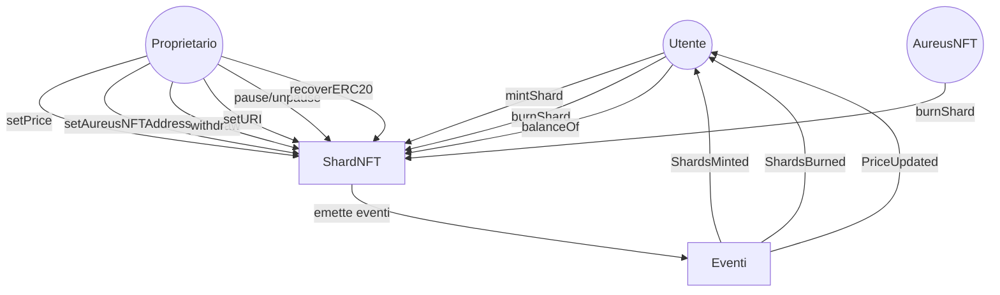
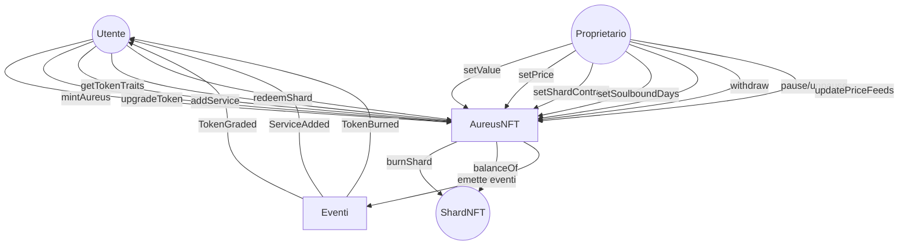
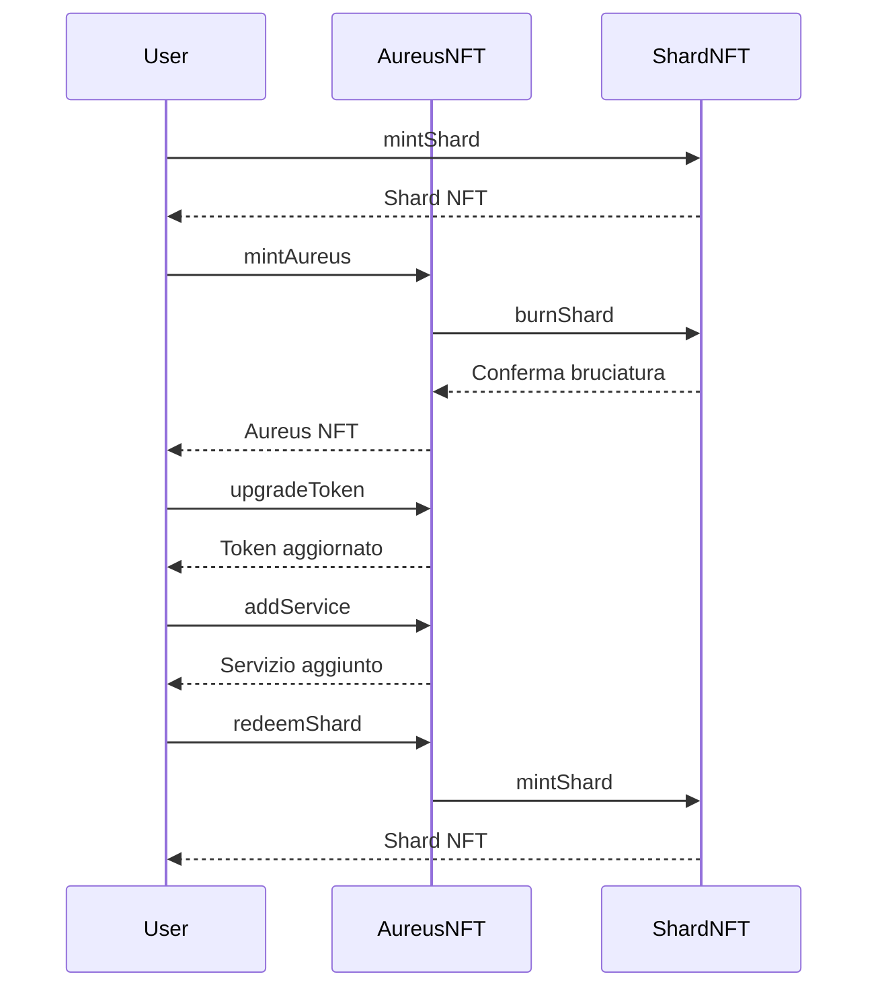

# Interactions
## Shard

```mermaid
graph TD
    User((Utente))
    Owner((Proprietario))
    AureusNFT((AureusNFT))

    User -->|mintShard| ShardNFT
    User -->|burnShard| ShardNFT
    User -->|balanceOf| ShardNFT
    
    Owner -->|setPrice| ShardNFT
    Owner -->|setAureusNFTAddress| ShardNFT
    Owner -->|withdraw| ShardNFT
    Owner -->|setURI| ShardNFT
    Owner -->|pause/unpause| ShardNFT
    Owner -->|recoverERC20| ShardNFT

    AureusNFT -->|burnShard| ShardNFT

    ShardNFT -->|emette eventi| EventEmitter[Eventi]
    EventEmitter -->|ShardsMinted| User
    EventEmitter -->|ShardsBurned| User
    EventEmitter -->|PriceUpdated| User
```
## Aureus

```mermaid
graph TD
    User((Utente))
    Owner((Proprietario))
    ShardNFT((ShardNFT))

    User -->|mintAureus| AureusNFT
    User -->|upgradeToken| AureusNFT
    User -->|addService| AureusNFT
    User -->|getTokenTraits| AureusNFT
    User -->|redeemShard| AureusNFT
    
    Owner -->|setValue| AureusNFT
    Owner -->|setPrice| AureusNFT
    Owner -->|setShardContract| AureusNFT
    Owner -->|setSoulboundDays| AureusNFT
    Owner -->|withdraw| AureusNFT
    Owner -->|pause/unpause| AureusNFT
    Owner -->|updatePriceFeeds| AureusNFT

    AureusNFT -->|burnShard| ShardNFT
    AureusNFT -->|balanceOf| ShardNFT

    AureusNFT -->|emette eventi| EventEmitter[Eventi]
    EventEmitter -->|TokenGraded| User
    EventEmitter -->|ServiceAdded| User
    EventEmitter -->|TokenBurned| User
```
## Comuni

```mermaid
sequenceDiagram
    participant User
    participant AureusNFT
    participant ShardNFT

    User->>ShardNFT: mintShard
    ShardNFT-->>User: Shard NFT
    User->>AureusNFT: mintAureus
    AureusNFT->>ShardNFT: burnShard
    ShardNFT-->>AureusNFT: Conferma bruciatura
    AureusNFT-->>User: Aureus NFT

    User->>AureusNFT: upgradeToken
    AureusNFT-->>User: Token aggiornato

    User->>AureusNFT: addService
    AureusNFT-->>User: Servizio aggiunto

    User->>AureusNFT: redeemShard
    AureusNFT->>ShardNFT: mintShard
    ShardNFT-->>User: Shard NFT
```
